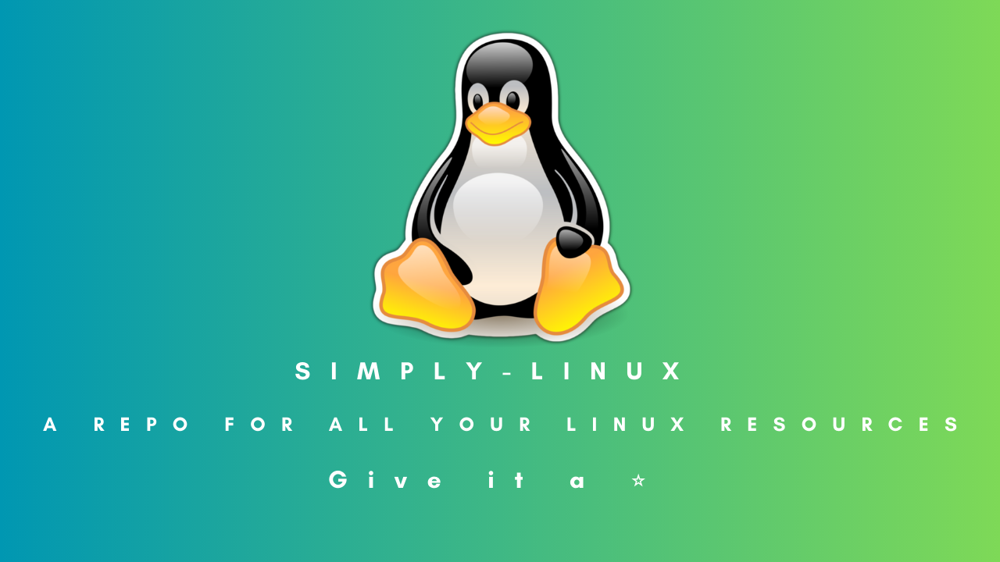

    

# Welcome to Simply-Linux 👾 

Simply Linux is a resources repo for Linux beginners who want to learn and upskill themselves. Give it a star ⭐ and contribute to any improvement, Your contributions are most welcome 😇. Add some more resources to contribute and help Current as well as future learners and beginners. 

## Install any Linux distro on VirtualBox (Guide)-> [Guide to Installing Linux Distro(s) on VirtualBox](https://github.com/Satyxm/Simply-Linux/blob/main/Installation%20Guide%20On%20VirtualBox.md#installing-linux-distros-onto-virtualbox)

## Resources:
- [Linux Introduction (All you need to know to get started with the Terminologies)](https://satyams.hashnode.dev/linux-prelude-and-some-basic-terminologies)
- [Basic Commands to get started with](https://satyams.hashnode.dev/10-most-basic-linux-commands-installation-of-a-linux-distro-on-virtualbox-guide-resource)
- [All About the Command Line](https://satyams.hashnode.dev/unlock-the-power-of-linux-with-command-line-mastery)
- [Linux Processes](https://satyams.hashnode.dev/process-powerplay-unleashing-the-potential-of-linux-with-essential-process-commands-and-concepts-1))
- [Changing the VB Password](https://satyams.hashnode.dev/how-to-change-the-ubuntu-vb-passwd)

