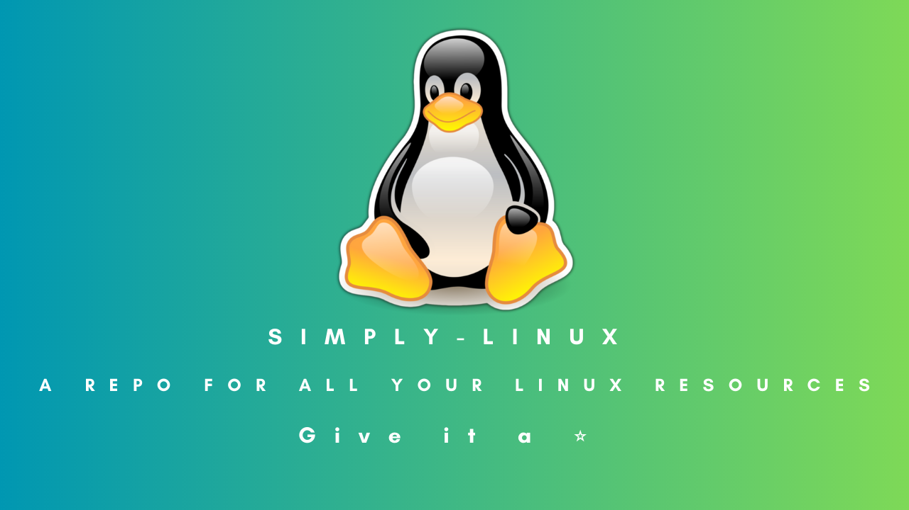

    

# Welcome to Simply-Linux 👾 

Simply Linux is a resources repo for the Linux beginners who want to learn and upskill themselves. Give it a star ⭐ and contribute for any improvement, Your contributions are most welcome 😇. Add some more resources to contribute and help Current as well as future learners and beginners. 

## Installing Linux:
- Step 1: Firstly download Virtual box by clicking on the [link](https://www.virtualbox.org/)

- Step 2: Go to downloads and then, Select your distribution. Download will Start & then, Install VirtualBox. It's Simple!
- Step 3: Click [here](https://ubuntu.com/) and go to download section click on the latest version of the iso file. As of now it's 22.04 LTS(I prefer downloading LTS version because it's for a longer term and stands for 'Long Term Services')
- Step 4: Open Virtual box, then click on New and Give name to your machine and then select the type and the version (usually, both the type & version are automatically chosen by the virtualbox as you type in name of the machine.)
- Step 5: Now, by default you'll have a path in machine folder and if you want to change it then you can click on the drop down pointer and click on 'other' and select the folder you want. Click on next.
- Step 6: Select the memory size select it according to your device or like till the end of green mark. (the more the memory and the smoother it runs.) But it's advicable not to stretch it beyond the red mark because you'll need RAM for your Host OS also :). 

- Step 7: After Step 6, Click on 'next' leave the settings as it is and proceed further by clicking on 'Create' and for the Hard disk type also leave it as it is and click on 'Next'
- Step 8: Chose the file location and size as per your device and convenience. Click on 'Create'. And, Boom! You're machine will be added to the Virtualbox but, it's not over yet!!
- Step 9: Select the Virtual Machine you just created and then, click on the 'Settings' option present to the right of 'New'. In General section, go to 'Advanced' and then, You'll see that the 'Shared Clipboard' & 'Drag'n'Drop' options are 'Disabled' by default, You need to set them to 'Bidirectional'(means that with your host OS and your VM or Guest OS you will be able to drag'n'drop items and also they'll share the same clipboard) Leave everything as it is and proceed to the 'System' setion.
- Step 10: In the 'System' section, go to 'Processor' and set the Processors you'll be allocating to the CPU as till the green mark or also as per your convenience (By default, it will allocate only 1 processor to the VM) again Leave 'Display' as default since we want to access terminal so we'll not focus on it so much and then
- Step 11: Go to 'Storage' and then click on the 'Empty' written under the 'Controller IDE' and then go to the leftmost blue disk icon and click on it select 'Choose a disk file' and go where you're Ubuntu ISO File is located then, Select the ISO File and click on 'Open' and Now you'll be able to see the name of the ISO File where it was previously written 'Empty' Now leave remaining settings set as default and Click on 'OK'.
- Step 12: Make sure your virtual machine is selected and then click on 'Start' and then select 'Try or install ubuntu' and press enter adn now your ubuntu installation will begin.
- Step 13: Choose your 'language' and click on 'Install ubuntu' choose your Keyboard Layout as per your convenience (for eg: I use English(US)) and after selecting, Click on 'Continue'.
- Step 14: In the 'Updates and other software' -- The following should be selected: 1. Normal Installation 2. Download updates while installing Ubuntu 3. Install third-party software for graphics and Wi-Fi hardware and additional media formats and then, Click on 'Continue'
-Step 15: In 'Installing Type' --- Make sure 'Erase disk and install Ubuntu' is seleted, (If you're confused or worried about what does Erase disk means here then let me tell you Since, you're installing Ubuntu on a virtual box that means none of your data will be erased from your Host OS. The 'Erase disk' step is valid only for those folks who install ubuntu on their Hardware(Not virtually))

## Resources:
- [Linux Introduction (All you need to know to get started with the Terminologies)](https://satyams.hashnode.dev/linux-prelude-and-some-basic-terminologies) 
